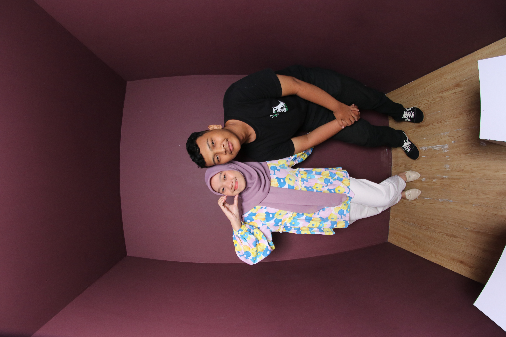
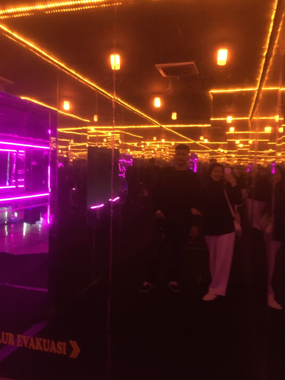

# 🎂 Happy Birthday Website - Panduan Penggunaan & Editing

Selamat datang! Dokumen ini akan membantu Anda memahami cara menggunakan dan mengedit website ucapan ulang tahun ini. 🎉

---

## 📋 Daftar Isi

1. [Memulai](#memulai)
2. [Mengubah Informasi Dasar](#mengubah-informasi-dasar)
3. [Mengubah Foto](#mengubah-foto)
4. [Mengubah Pesan & Teks](#mengubah-pesan--teks)
5. [Mengubah Musik/Lagu](#mengubah-musiklagu)
6. [Mengubah Tanggal Lahir](#mengubah-tanggal-lahir)
7. [Struktur Folder](#struktur-folder)

---

## 🚀 Memulai

### File yang Perlu Diedit:

- **`index.html`** - File utama yang berisi struktur website
- **`script.js`** - File JavaScript untuk fungsi dinamis
- **`style.css`** - File CSS untuk styling tambahan
- **Folder `img/`** - Tempat menyimpan semua foto dan video

---

## ✏️ Mengubah Informasi Dasar

### Mengubah Nama Orang yang Merayakan

Cari di `index.html`:

```html
<h1 class="text-5xl md:text-7xl font-anime drop-shadow-lg">Happy Birthday, Fina Nailu Zahira!</h1>
```

**Ubah nama** dari `Fina Nailu Zahira` dengan nama orang yang Anda rayakan.

---

## 📸 Mengubah Foto

### Section 3: Photobooth Memories (Timeline)

Di bagian ini ada 4 foto utama. Caranya mengubah:

1. **Foto 1** - `img/foto1.JPG` → Ganti dengan nama file foto Anda
2. **Foto 2** - `img/foto2.JPG`
3. **Foto 3** - `img/foto3.JPG`
4. **Foto 4** - `img/foto4.JPG`

**Kode yang perlu diubah:**
```html

```

**Ganti dengan:**
```html

```

---

### Section 4: Hall of Fame (Foto Kartu)

Ada 6 kartu dengan foto. Lokasi file:

- `img/foto5.png` → Foto kartu 1
- `img/foto6.png` → Foto kartu 2
- `img/foto7.png` → Foto kartu 3
- `img/foto8.png` → Foto kartu 4
- `img/foto9.png` → Foto kartu 5
- `img/foto10.png` → Foto kartu 6

**Langkah mengubah:**

1. Siapkan 6 foto dengan format `.jpg` atau `.png`
2. Rename sesuai urutan atau upload dengan nama yang konsisten
3. Di `index.html`, ubah path di setiap kartu:

```html

```

**Ubah caption (judul foto):**
```html
<h3 class="text-2xl font-anime text-sakura">Photo 1</h3>
<p class="mt-2">"Ga cuma tempatnya yang indah, harinya juga jadi lebih seru karena ada kamu."</p>
```

---

### Section 5: The Y.V.A. Collection (Gallery)

Ada 12 foto di gallery. File yang perlu diubah:

- `img/foto11.jpeg` sampai `img/foto22.jpeg`

**Langkah:**

1. Siapkan 12 foto
2. Rename dengan nama `foto11.jpeg`, `foto12.jpeg`, dst
3. Upload ke folder `img/`
4. Kode secara otomatis akan mengambil foto tersebut

---

### Section 1: Background Video

File background video di header:

```html
<video autoplay loop muted playsinline class="...">
  <source src="img/background.mp4" type="video/mp4">
</video>
```

**Untuk mengubah background video:**

1. Siapkan video dalam format `.mp4`
2. Rename menjadi `background.mp4`
3. Upload ke folder `img/`

---

## 💬 Mengubah Pesan & Teks

### Section 2: A Special Message (Pesan Khusus)

Cari bagian ini di `index.html`:

```html
<p>Hey Fina Nailu Zahira ,</p>
<p>Semoga di umur yang sekarang, kamu makin bahagia, makin kuat, dan semua hal baik selalu dateng ke hidup kamu. ...</p>
```

**Ganti dengan pesan Anda sendiri.** Anda bisa menambah atau mengurangi paragraf sesuai kebutuhan.

---

### Section 3: Photobooth Memories (Judul & Deskripsi)

Setiap foto punya judul dan cerita. Ubah seperti ini:

```html
<h3 class="text-2xl font-anime text-sakura">Our first Meeting</h3>
<p class="mt-2 text-lg">"Masih inget banget gimana semuanya mulai dari sini. ..."</p>
```

**Ubah judul dan cerita sesuai kenangan Anda!**

---

### Section 4: Hall of Fame (Caption Foto)

Setiap kartu punya caption. Ubah teksnya:

```html
<p class="mt-2">"Ga cuma tempatnya yang indah, harinya juga jadi lebih seru karena ada kamu."</p>
```

---

## 🎵 Mengubah Musik/Lagu

File musik berada di `img/perfect.mp3`

Untuk mengubah lagu:

1. **Siapkan file MP3** dari lagu pilihan Anda
2. **Rename menjadi** `perfect.mp3`
3. **Upload ke folder** `img/`

**Atau gunakan URL online:**

Di `index.html`, cari:
```html
<source src="img/perfect.mp3" type="audio/mpeg">
```

**Ganti dengan URL lagu:**
```html
<source src="https://link-ke-lagu-anda.mp3" type="audio/mpeg">
```

---

## 📅 Mengubah Tanggal Lahir

Di file `script.js`, cari:

```javascript
const birthDate = new Date('2005-05-26T00:00:00');
```

**Ubah dengan tanggal lahir yang benar:**

```javascript
const birthDate = new Date('YYYY-MM-DDTHH:MM:SS');
```

**Contoh:** Jika lahir 15 Maret 2000:
```javascript
const birthDate = new Date('2000-03-15T00:00:00');
```

Usia akan otomatis terupdate setiap detik berdasarkan tanggal ini! ⏰

---

## 📁 Struktur Folder

```
Happy-Birthday/
├── index.html           (File utama website)
├── script.js            (File JavaScript)
├── style.css            (File styling)
├── README.md            (File dokumentasi ini)
└── img/                 (Folder untuk semua media)
    ├── background.mp4   (Video background)
    ├── perfect.mp3      (File lagu)
    ├── foto1.JPG        (Timeline photo 1)
    ├── foto2.JPG        (Timeline photo 2)
    ├── foto3.JPG        (Timeline photo 3)
    ├── foto4.JPG        (Timeline photo 4)
    ├── foto5.png        (Hall of Fame card 1)
    ├── foto6.png        (Hall of Fame card 2)
    ├── foto7.png        (Hall of Fame card 3)
    ├── foto8.png        (Hall of Fame card 4)
    ├── foto9.png        (Hall of Fame card 5)
    ├── foto10.png       (Hall of Fame card 6)
    ├── foto11.jpeg      (Gallery photo 1)
    ├── foto12.jpeg      (Gallery photo 2)
    └── ... (foto13-foto22 untuk gallery)
```

---

## 🎨 Tips Editing

1. **Format Foto:** Gunakan JPG atau PNG untuk performa terbaik
2. **Ukuran Foto:** Idealnya 800x600 pixel atau lebih untuk kualitas baik
3. **Video:** Format MP4 dengan ukuran di bawah 50MB untuk loading cepat
4. **Browser:** Buka dengan browser modern (Chrome, Firefox, Safari, Edge)
5. **Local Testing:** Buka file `index.html` di browser untuk test sebelum upload

---

## 🚀 Cara Publish

1. **GitHub Pages:** Upload ke GitHub repo dan aktifkan Pages
2. **Netlify:** Drag & drop folder ke netlify.com
3. **Vercel:** Connect GitHub repo ke Vercel

---

## ❓ Tips Troubleshooting

**Foto tidak muncul?**
- Pastikan nama file foto sesuai dengan path di code
- Foto harus berada di folder `img/`
- Cek format file (jpg, png, jpeg)

**Video tidak muncul?**
- Format harus `.mp4`
- Nama file harus `background.mp4`
- Ukuran file tidak terlalu besar

**Musik tidak terdengar?**
- Pastikan file `perfect.mp3` ada di folder `img/`
- Cek koneksi internet jika menggunakan URL

---

## 📝 Checklist Sebelum Publish

- [ ] Nama sudah diganti
- [ ] Semua foto sudah diupload ke folder `img/`
- [ ] Pesan sudah disesuaikan
- [ ] Tanggal lahir sudah diubah di `script.js`
- [ ] Video background sudah ada
- [ ] File musik sudah ada atau URL valid
- [ ] Semua path file sudah benar
- [ ] Sudah di-test di browser lokal

---

**Selamat membuat ucapan ulang tahun yang spesial! 🎂💖**
